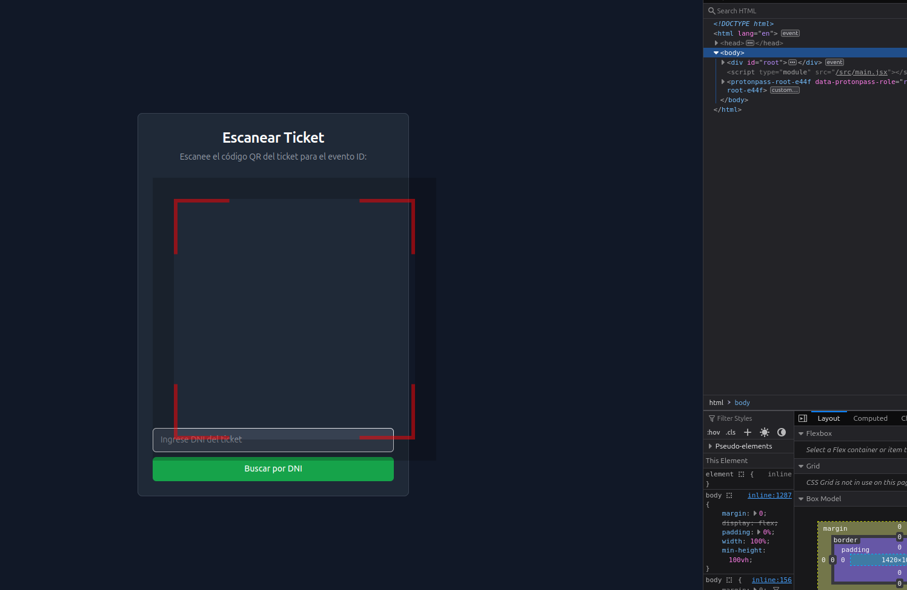

# TODO List

## Aesthetic
- [ ] Aesthetic 1: Cambiar el color blanco del borde del toggle de habilitar y desabhilitar venta de tickets en ~/src/pages/EventDetails
- [ ] Aesthetic 2: El porcentaje de personas que ingresaron lo haria ligeramente mas llamativo pasa como desapercibido ~/src/pages/EventDetails, ademas si ingreso el 0% de personas no se entiende que es una barra de progreso, deberia darse a entender aunque este vacia

## Refactor
- [ ] Feature 1: Description of feature 1
- [ ] Feature 2: Description of feature 2

## Features - Improvements
- [ ] Feature 1: Al crear un evento deberia preguntar si desea guardar/utilizar el dni de las personas para los tickets como opcional para mas seguridad etc, deberia ser una especie de toggle o check
- [ ] Feature 2: Al crear un ticket debe aparecer una pestaña intermedia indicando el exito y permitiendo compartir desde aqui, sino tenes que irte a buscarlo a la lista medio garron
- [ ] Feature 3: Estaria bueno tener pagina de venta propias sin terceros
- [ ] Feature 4: los ultimos tickets creados deberian aparecer primero en ~/src/pages/EventDetails
- [ ] Feature 5: Siosi hay que incluir el concepto de entrada vip o diferentes tipos de tickets, ver como manejarlo
- [ ] Feature 6: Ver como manejar el tema del cobro a los organizadores, deberiamos nosotros ponerle al organizador como atributo cantidad de tickets que puede vender y a partir de ese campo pueda generar ventas libremente en cualquier evento

## Bugs
- [ ] Bug 1: El scanner full bugueta nose que le abra pasado
- [ ] Bug 2: Cuando no tiene el permiso de la camara se buguea momentaneamente el scanner, controlar 

## Documentation
- [ ] Documentation Task 1: Description of documentation task 1

## Testing
- [ ] Testing Task 1: Description of testing task 1